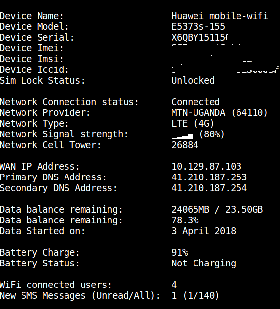

Introduction
------------

This script queries a compatible Huawei LTE WiFi router (MiFi) to get detailed
information such as signal strength, battery status, remaining data balance,
number and addresses of currently connected device(s) etc.

The following information can be queried for using this tool:

1. Device Name, Model, Serial IMEI, and IMSI Numbers

2. SIM lock status

3. Network Connection Status, including network provider, type, signal strength,
   and cell tower

4. WAN IP, Primary, and Secondary DNS addresses

5. Remaining data balances and start date

6. Battery status, level and whether device is charging or not charging 

7. Number and host names of devices connected to the WiFi router

8. Number of New and Old SMS messages

**NOTE:** This script was tested using a Huawei WiFi router model No. E5373s-155

For updates to this, and other CLI tools, please follow me on twitter: **[@jzikusooka](@jzikusooka)** or email me at *josephzik AT gmail.com*

Your contributions are welcome.  For bug fixes, please open an issue

Devices known to work
---------------------
(Tested)
- Huawei E5373s-155

(Not yet Tested)
- Huawei B310s

Requirements
------------
1. coreutils 8+ packages with base64 and sha256sum utilities

Usage
------
Usage: ./query_huawei_wifi_router.sh [IP_ADDRESS] [LOGIN_USER] [LOGIN_PASSWORD][TASK (Optional)]

  e.g. ./query_huawei_wifi_router.sh 192.168.8.1 admin secret info_all

Tasks
-----
info_all

battery

data

users

sms_read

sms_send [NUMBER] [MESSAGE]

reboot
